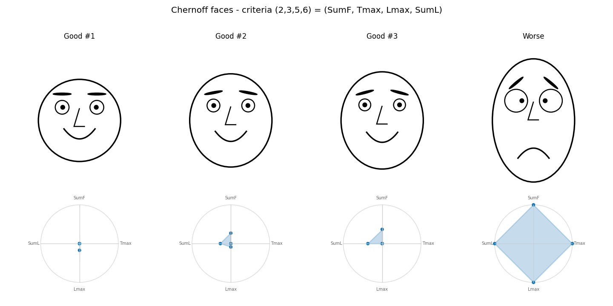

# Multi-criteria Permutation Flow Shop — Optimization & Visualization

A small, dependency-light Python toolkit for multi-criteria optimization of the **permutation
flow shop** problem with three machines. It provides two simulated-annealing optimizers
(a Pareto-front search and a scalarized search), a 2D hypervolume indicator for comparing fronts,
and a Chernoff-faces visualization for inspecting multi-criteria trade-offs. Everything is fully
deterministic given the seeds, and uses only the standard library plus `matplotlib`.



## Problem model

`n` jobs are processed on `m = 3` machines in the same job order on every machine, so a solution
is a permutation `pi` of the jobs (the decision variable). `p[i][j]` is the processing time of
job `j` on machine `i`. Completion times follow the recurrence

```
C[i][pi[k]] = max(C[i-1][pi[k]], C[i][pi[k-1]]) + p[i][pi[k]]
```

with `C[-1][...] = 0` and `C[i][pi[-1]] = 0`. Let `Cm[j] = C[2][j]` be the completion time of
job `j` on the last machine. Each job has a due date `d[j]` keyed by **input order** (job index
`j`), not by execution position.

Four minimization criteria are supported:

| criterion | definition |
|---|---|
| `SumF` — total flowtime | `sum_j Cm[j]` |
| `Tmax` — max tardiness | `max_j max(Cm[j] - d[j], 0)` |
| `Lmax` — max lateness | `max_j (Cm[j] - d[j])` (may be negative) |
| `SumL` — total lateness | `sum_j (Cm[j] - d[j])` |

Tardiness is the non-negative part of lateness, so `Tmax = max(0, Lmax)`: the two coincide
whenever any job is late and diverge only when every job meets its deadline. For a fixed instance
`SumL = SumF - sum_j d[j]`, i.e. `SumL` and `SumF` differ by a constant and are perfectly
rank-correlated.

## Instance generation

Instances are produced with the bundled `RandomNumberGenerator` only. The order of `nextInt`
calls is fixed and load-bearing for reproducibility:

```
init(seed)
S = 0
for i in 0..2:            # machine (outer loop)
    for j in 0..n-1:     # job (inner loop)
        p[i][j] = nextInt(1, 99)
        S += p[i][j]
for j in 0..n-1:
    d[j] = nextInt(floor(S/4), floor(S/2))
```

Processing times are filled **machine-major** (`3n` draws), then `n` due dates are drawn.
Two independent generators are used: one seeded for **instance generation** and a separate one
for **search stochasticity** (initial permutation, neighbor choice, acceptance), so instances
stay reproducible independently of any search run.

## Optimizers

### Pareto Simulated Annealing (`pareto_sa`)

Starts from a random permutation, repeatedly draws a random neighbor, accepts it when it
dominates the current solution and otherwise with probability `p(it)`; every accepted solution is
archived, and the Pareto front is the non-dominated subset of the archive. The front is returned
with the underlying permutations so it can be reused downstream.

- Acceptance probability: constant (`p(it) = 0.1`, default) or geometric (`p(it) = 0.995**it`).
- Neighborhood: `swap` and `insert` moves (default `insert`).
- Criteria are pluggable via an `evaluate` callback — bi-criteria `(SumF, Tmax)` by default,
  or the full four for the visualization.

### Scalarized Simulated Annealing (`scalarized_sa`)

Reduces several criteria to a single score `s(x) = c1*SumF + c2*Tmax + c3*Lmax` and runs a
standard SA on it, tracking the best-seen solution.

Because the criteria live on very different scales (`SumF` is a sum over `n` jobs; `Tmax`/`Lmax`
are single maxima), the coefficients default to the inverse of each criterion's estimated scale:
a handful of random permutations are sampled, `scale_i` is the mean of `|criterion_i|` over them,
and `c_i = 1 / scale_i`, giving every criterion a comparable `~1` contribution. The coefficient
vector is a parameter, so custom weightings can be supplied without touching the algorithm.

### Hypervolume indicator

`hypervolume_2d` measures the dominated area between a 2D front and a nadir reference point
(sort by x, sum the staircase rectangles). It is used to compare fronts produced at different
iteration budgets.

## Visualization — Chernoff faces

`chernoff.py` renders each solution as a face whose features encode the four criteria
`(SumF, Tmax, Lmax, SumL)`, drawn with matplotlib primitives only:

- `SumF` → face height
- `Tmax` → mouth curvature (smile vs frown)
- `Lmax` → eye size and inward pupil gaze
- `SumL` → eyebrow angle (level vs angry "V")

The nose is a fixed decorative feature. Each criterion is min–max normalized across exactly the
faces shown together, so smaller (better) criterion values render the "nicer" face (short, round,
smiling, small forward-looking eyes, level brows). In the image above, the three "Good" faces are
non-dominated front solutions and the "Worse" face is a weaker random solution.

## Layout

```
src/instance.py        # instance generation, FlowShopInstance dataclass
src/schedule.py        # completion matrix + the four criteria
src/pareto.py          # dominance, front extraction, 2D HVI
src/neighborhood.py    # swap / insert moves, random permutation
src/algorithms.py      # pareto_sa, scalarized_sa
src/chernoff.py        # Chernoff faces renderer
experiments/           # runnable studies (see below)
results/               # generated plots and tables
```

## Install & run

```
pip install -r requirements.txt          # or: uv pip install -r requirements.txt
python -m experiments.verify             # sanity checks (no plotting needed)
python -m experiments.task1              # Pareto SA: scatter plots + HVI table
python -m experiments.task2              # Scalarized SA: s(xbest) table + plot
python -m experiments.chernoff_faces     # Chernoff faces of front vs weaker solution
```

Run from the repository root so the `src` package resolves. The default instance is
`n = 50, seed = 1`; all search seeds are derived deterministically inside each script, so reruns
reproduce identical numbers and figures.

Outputs land in `results/`:

- `task1_scatter_<maxIter>.png` — population `P` (blue) with the front `F` highlighted (red).
- `task1_fronts_combined.png` — fronts for all iteration budgets overlaid.
- `task1_hvi.csv` — mean hypervolume per iteration budget over 10 runs.
- `task2_scalar.csv` / `task2_scalar.png` — mean and best `s(xbest)` per iteration budget, plus
  the raw `(SumF, Tmax, Lmax)` of the best solution.
- `chernoff_faces.png` — the four faces.

## Verification

`experiments/verify.py` hand-checks the completion-time recurrence on a tiny instance, confirms
that the criteria are keyed by job index (not schedule position), checks dominance and front
extraction on a small point set, validates the 2D hypervolume on trivial cases, and confirms that
the same seed reproduces the same instance.
